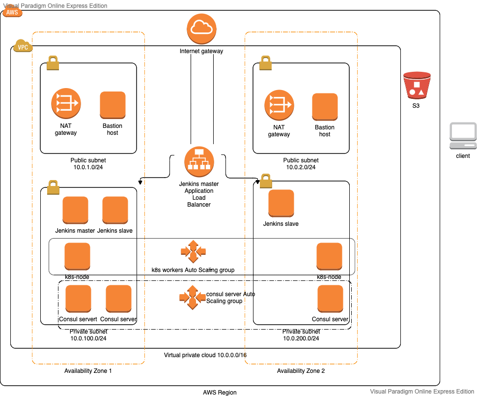

# Under construction

# project

# Architecture

###

After clone the repository:

# Prepare AMI
1. Download packer 
https://www.packer.io/downloads

2. Unzip and move packer binary to location in PATH
Example for mac os: 
mv packer /usr/local/bin/

# Create ubuntu based AMI
1. cd packer/ubuntu
2. cp vars_example.json vars.json
3. vim vars.json 
4. Set all the required variables in vars.json file 
(git is set to ignore vars.json)
5. build the AMI:
   packer build -var-file=./vars.json template.json
6. Save the AMI ID from packer output for later use
(ami-083547ef8b8f5b0bc)

# Create s3 bucket for remote state
1. cd s3
2. terraform init
3. terraform apply

# Deploy the infrastructur

# Consul configuration - Todo - Automate this
1. ssh to ansible instance
   ssh -i service_discovery_key.pem ubuntu@<ip>

2. cd ansible
3. Configure ssh to consul cluster
   ansible-playbook configure_ssh.yml -e ansible_python_interpreter=/usr/bin/python3
4. Configure consul
   ansible-playbook -i aws_ec2.yml setup_env.yml -e ansible_python_interpreter=/usr/bin/python3

#### EKS Notes ####
 
1. In order to allow pod running in the EKS cluster which runs kandula, which uses boto3 and need access to ec2 service:
   In the eks-cluster.tf, in the usage of "eks" module -
   we set "enable_irsa" to true:
   enable_irsa = true
   irsa is "IAM roles for service accounts", can read about it in this link:
   https://docs.aws.amazon.com/eks/latest/userguide/iam-roles-for-service-accounts.html
   In short:
   - It create OIDC (open ID connect) provider for our cluster to manage identities
   - We create policy and role with this policy, and in the role trust we define the assume 
   role such that the "role" will trust what it gets from the OIDC provider which is
   a service account in a defined namespace as seen example below.
   The name of the service accout is the service account name that kandula will use, 
   we will create this service account for kandula with annotation that the value will
   be the name of the role
   "Action": "sts:AssumeRoleWithWebIdentity",
         "Condition": {
         "StringEquals": {
            "${OIDC_PROVIDER}:sub": "system:serviceaccount:<my-namespace>:<my-service-account>"
         }
         }

2. In order to allow Jenkins slaves access EKS cluster need to -
   a. After the environement is up run the following to update your kubeconfig file 
      (you can get the cluster_name value from the cluster_name output in terraform)
      note - after we update the configmap i step b, dont we need to get the updated kubeconfig
      , kbeconfig get updated - verify this again (before upload to jenkins in step c)
   aws eks --region=us-east-1 update-kubeconfig --name <cluster_name>

   b. Need to update the aws-auth config map -
      under "mapRoles" section, need to add entry for the "rolearn" we created
      for the jenkins slaves (this role provide access to EKS)
      Example:
      - rolearn: arn:aws:iam::031034181336:role/eks_role 
      username: eks_role
      groups: 
        - system:masters

   c. After install the k8s plugin in Jenkins master, need to create k8s credentials 
      and supply the kubeconfig file

aws eks --region=us-east-1 update-kubeconfig --name project-eks
aws sts get-caller-identity
kubectl edit configmap aws-auth -n kube-system

Need to edit config map and add so:

kubectl edit configmap aws-auth -n kube-system -o yaml

- "groups":
  - "system:masters"
  "rolearn": "arn:aws:iam::783216792412:role/project-ec2-iam-role"
  "username": "project-ec2-iam-role"

  node("amazon-linux2") {
    stage("Deploy") {
     kubernetesDeploy configs: 'k8s/deploy-kandula.yaml', kubeConfig: [path: ''], kubeconfigId: 'k8s', secretName: '', ssh: [sshCredentialsId: '*', sshServer: ''], textCredentials: [certificateAuthorityData: '', clientCertificateData: '', clientKeyData: '', serverUrl: 'https://']
    }
}

node("amazon-linux2") {
    stage("Deploy") {
     kubernetesDeploy configs: 'k8s/deploy-kandula.yaml',kubeconfigId: 'k8s'
     kubernetesDeploy configs: 'k8s/svc-lb-kandula.yaml',kubeconfigId: 'k8s'
    }
}

after installing k8s plugin, need to add k8s credentials - for kube config, i entered the file content option but we can also provide path
for ~/.kube/config (but need somehow to put this file on jenkins, because we can not run the aws command , no aws installed on the jenkins master , we have the ~/.kube/config in the ami)

1. terraform init

2. terraform apply

3. # todo - automate this 
# Configure (manually) configmap aws-auth - To add the Jenkins slave role
Taken from :
https://registry.terraform.io/modules/WesleyCharlesBlake/eks/aws/latest

I did this:
On my mac run:

Under "mapRoles" sectoion add:  todo - use Micky flow
- "groups":
      - "system:nodes"
      "rolearn": "arn:aws:iam::783216792412:role/project-ec2-iam-role"
      "username": "system:node:{{EC2PrivateDNSName}}"

note - 
In docs i see to add "system:masters" group and map to some user name and then
create cluster role binding for that user but i did not do it like so

Also via terraform remote-exec provisioner in Jenkins slave i executed 
aws eks update-kubeconfig --name project-eks --region us-east-1

to create the .kube/config file

4. configure jenkins -
If using then AMI for jenkins then need to add the agents
Otherwise, if using the remote-exex provisioner, hen need to configure jenkins:
In browser enter jenkins load balancer DNS (Example: jenkins-alb-923034631.us-east-1.elb.amazonaws.com)
First add slaves (with lable 'amazon-linux2')
Add credentioals for ec2-user (SSH Username with private key)
Install plugin : SSH Build Agents
- name: jenkins-agent01, also check 'Permanent Agent'
- number of executors: 2
- Remote root directory: (relaibe: ./jenkins-agent)
- Labels: amazon-linux2
- Usage: use this as much as possible
- Launch method: ssh , add slave private ip, and the ssh credentials for the ec2-user added previously
- Host Key Verification Strategy: Non verifiying verification stratrgy
- Availability: Keeping this agent as much as possible
- save
- then press on the node and press - relaunching agent ## Todo - need to add security gropu only for jenkins agents that has inbound rule to allow only jenkins master and also the bastion (and need to remove the sg-jenkins security group from them)

a. Install plugins:
Go to manage Jenkins -> Plugin manager , and install following plugins (check the plugin and press on 'install without restart') 
GitHub Plugin
GitHub Branch Source Plugin
docker
Build Monitor View
○ BlueOcean Aggregator
○ Slack Notification 
Pipeline
Test Results Analyzer
Pyenv Pipeline
Kubernetes Continuous Deploy

b. 
In github: create github app : 
 Go to settings -> developer settings -> GitHub Apps -> New GitHub App (Todo - Add Shakeds' flow here + the convet of the private key)
Add gihhub (GitHub App)

   Add dockerhub (Username with password) - credential id: DockerHub (important because this is how it appears in the Jeninsfile)
- Configure slack:
  Add slack credentials (Secret text)
  manage jenkins -> Configure system -> go to Slack section

  workspace: opsschool

  # Flow - to add
  - create images with packer
  - Edit terraform.tfvars, set values
  - Create the s3 bucket to hold the state file
  Deploy the infrastructure [terraform apply]
   a. After the environement is up run the following to update your kubeconfig file (~/.kube/config)
      (you can get the cluster_name value from the cluster_name output in terraform)
   run:
   aws eks --region=us-east-1 update-kubeconfig --name project-eks

   b. Need to update the aws-auth config map 
      [to allow jenkins slaves deploy resources in the k8s cluster]
      Run:
      kubectl edit configmap aws-auth -n kube-system

      and edit:
      under "mapRoles" section, need to add entry for the "rolearn" we created
      for the jenkins slaves (this role provide access to EKS)
      Example:
      - "rolearn": arn:aws:iam::783216792412:role/jenkins_role
        "username": jenkins_role
        "groups":
          - system:masters

  Explain how to: 
   configure ssh to bastion
   configure jenkins
   - install k8s plugin
   - Create k8s credentials:
     press "Add credentials"
     In "kind" drop down choose "kubernetes configuration (kubeconfig)
     Set the "ID" field
     choose "Edit directly" 
     copy and past the kubeconfig file which was created during infa deployment 
     (file path: ~/.kube/config)
     save changes
   - Create github app creadensials (need to create the github app first in GH)
   - Create pipeline job
     - Job configuration:
       In the "Pipeline" section choose:
       Pipeline script from SCM
       SCM: git
       Set the repository URL
       Choose the github app credentials
       Set the branch (example */master)
       Save the changes
    - Run the job
      To reach kandula - need to get the LB service DNS, run:
      kubectl get svc 

  configure consul with Ansible
  ansible:
  after deploy the infra with terraform, ssh to the ansible instance (via bastion) - to do use Adams' method 
  on ansible instance:
  1. cd ~/ansible
  <!-- 2. Configure ssh  - will not configure ssh, we will use --private-key cli option instead in each ansible comand (because when i run the yml to configur ssh in ~/.ssh/config, it configure the dns name,
  - maybe need to change the jinja2 template that for each node in the consul_clster group, will take the private_ip, because otherwise it uses the private dns name of each instance, and this s not reachable, no resolving, so need to use private ips instead of the private dns name)
    [this will create ssh configuration for each node in the consul cluster i.e 3 consul-slaves and one consul agent which is the jenkins-master instance]: -->

    <!-- ansible-playbook -i aws_ec2.yml configure_ssh.yml -->

    <!-- BTW, here is how to see setup:
    ansible -i aws_ec2.yml --private-key ~/.ssh/project_key consul_agents -m setup -->

  2. Install consul
    ansible-playbook -i aws_ec2.yml --private-key ~/.ssh/project_key setup_env.yml

   # issues:
   a. With Jenkins when apache role failed because some issue with apt aupdate
      on jenkins, issue wih the url of some repo .. need to check again if not temp problem
   b. With consul - 
      1. Was not able to get response from the console load balancer -
         need to see the security group of the consul lb and also the consul servers

      2. Need to add to the consul servers security group all the port Miki showed:
         8300 tcp / 8302 udp and tcp / 8600 udp and tcp 
      3. Need to install helm and use the hep chart for consul  - 01:10:40 in Miki last video class
     